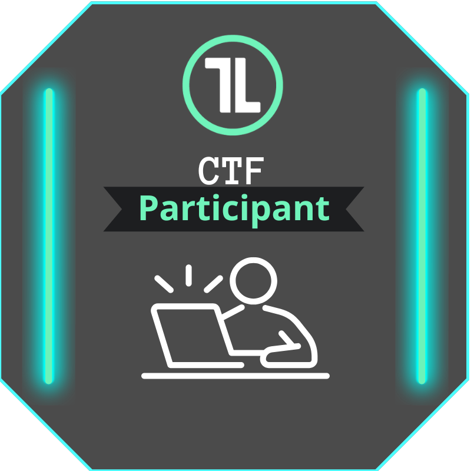

# Trace Labs Global OSINT Search Party CTF: A Solo Participant Write-Up

<p align="center">
  
</p>

On June 6, 2026, I participated in a formal [Trace Labs](https://www.tracelabs.org/) Global OSINT Search Party CTF as the solo team **Cipher Stealth**.

Trace Labs Search Party CTFs are not conventional cybersecurity games. The cases involve real missing people, and the intelligence collected by participants may support real investigations. The competitive structure helps coordinate and motivate the work, but the score is not the mission. The purpose is to produce accurate, relevant, and responsibly collected open-source intelligence that may help.

This write-up intentionally excludes all case names, personal information, direct source links, findings, and evidence screenshots. It focuses only on methodology and lessons learned, in line with [Trace Labs' guidance for public write-ups](https://docs.tracelabs.org/searchparty/writeups).

## Result

| Measure | Result |
|---|---:|
| Team | Cipher Stealth |
| Team size | 1 |
| Final place | 25th |
| Submissions | 19 |
| Points | 620 |


Teams could include up to four participants. Working solo meant that discovery, validation, evidence preservation, submission writing, and case switching all competed for the same limited time. Finishing 25th was meaningful to me, but the more important result was contributing vetted intelligence while staying within the rules and treating the cases with the seriousness they deserved.

## Rules I Worked By

My investigation remained passive and public:

- No contacting, following, messaging, calling, tagging, reacting to, or otherwise engaging with anyone connected to a case.
- No private groups, password resets, breached data, impersonation, active scanning, or aggressive scraping.
- No attempts to investigate or pursue persons of interest.
- No unsupported claims presented as facts.
- No submission based only on a matching name, username, or visual resemblance.
- Any potentially urgent, sensitive, or location-related information was for Trace Labs coaches to handle.

The core rule was simple: **view, verify, document, and submit without interacting**.

## My Solo Workflow

Five active missing-person cases were available during the event. I created a separate working area for each case and used the same structure throughout:

```text
Case intake
├── Search log
├── Source register
├── Lead reviews
├── Evidence log
├── Submission register
└── Final assessment
```

This structure helped me preserve context while moving between cases. It also forced a useful distinction between:

- Something I found.
- Something I could validate.
- Something relevant enough to submit.

Those are not the same thing.

### 1. Establish the Baseline

I began by recording the known identifiers, timeline, geography, and physical description supplied through the event. I also noted the official missing date and the boundaries of what was already known.

Official reports and news coverage were useful for understanding each case, but they were treated as starting points rather than automatically submission-worthy intelligence.

### 2. Search Broadly for an Initial Foothold

The first pass focused on finding independently accessible public sources that could establish a reliable foothold:

- Public social profiles
- Historical usernames and aliases
- Education or employment records
- Community publications
- Public archives
- Images that could support identity comparison

Search engines, platform-native searches, reverse-image searching, public archives, and metadata inspection all had a role. The tool mattered less than whether the resulting source was direct, reproducible, and relevant.

### 3. Validate Before Pivoting

Exact-name matches and username collisions were common. Before treating a profile or record as connected to a case, I looked for at least two meaningful tie-backs where possible:

- Matching face or known photograph
- Consistent location
- Cross-linked username
- Known family or friend network
- Matching school, employer, or community
- Consistent age or date range
- A link from another already validated source

A plausible lead without adequate support stayed a lead. It did not become a submission just because time was running out.

### 4. Preserve the Evidence

For each serious lead, I recorded:

- The direct source URL
- The claim supported by the source
- Why it was relevant
- Validation tie-backs
- Confidence and uncertainty
- Capture time
- A screenshot or preserved source where appropriate

Good evidence preservation reduced the chance of losing a source and made submission writing faster. More importantly, it made the reasoning reviewable by someone other than me.

### 5. Submit or Reject Deliberately

I maintained a submission register and a record of rejected leads. Recording rejections was unexpectedly valuable because it prevented repeated work and preserved the reason a promising result was not reliable enough.

Common rejection reasons included:

- Same-name or same-username collision
- No independent identity tie-back
- Search-result snippet without accessible underlying evidence
- Reposted or blacklisted source
- Platform-generated timestamp that did not prove user activity
- Information that was already public case context
- Claim that exceeded what the source actually demonstrated

Knowing when **not** to submit was part of the investigation.

## What Worked

### Structured Notes Beat Memory

Working five cases alone made context switching the main operational challenge. A consistent notebook structure let me leave one case, return later, and understand exactly what had been checked, validated, rejected, or left open.

### Direct Sources Produced Better Submissions

A direct public profile, archived page, or community document was generally more useful than a search-result snippet or a repost. Direct sources made the claim easier to reproduce and reduced ambiguity for coaches reviewing the submission.

### Identity Tie-Backs Prevented False Positives

The most important analytical discipline was refusing to treat a matching name as identity proof. Combining multiple independent tie-backs took longer, but it protected the integrity of the work.

### Negative Findings Still Had Value

Several promising leads did not survive validation. Documenting why they failed prevented duplicate effort and made it easier to redirect quickly instead of repeatedly reopening the same dead end.

## What I Would Change Next Time

### Separate Discovery, Validation, and Submission

I often moved through all three stages for one lead before searching again. A more efficient solo rhythm would be:

1. Run a bounded discovery sprint.
2. Rank the resulting leads.
3. Validate the strongest candidates.
4. Package submissions in a focused batch.

This would reduce the cost of constantly switching between investigative and administrative work.

### Narrow the Case Focus Earlier

Trying to maintain coverage across all five cases created breadth but limited depth. Next time, I would still perform an initial sweep across every case, then concentrate earlier on the cases where I had a validated foothold and a realistic path to useful intelligence.

### Prepare Submission Templates Before the Event

A prebuilt template for the claim, direct source, relevance, tie-backs, confidence, and uncertainty would reduce submission-writing time without lowering quality.

### Use Stronger Stop Conditions

Solo investigators cannot afford unlimited rabbit holes. I would set clearer time limits for weak username matches, inaccessible sources, and profiles without independent tie-backs.

## Main Lessons

1. **The score is an imperfect proxy for value.** A lower-point, well-supported fact may be more useful than a speculative high-value lead.
2. **Information without context is not intelligence.** Every submission needs a clear explanation of what the source proves and why it matters.
3. **Uncertainty should be documented, not hidden.** A coach-review candidate can still be useful when its limitations are explicit.
4. **False-positive control is a core OSINT skill.** Rejecting an attractive but unsupported lead is productive work.
5. **Documentation is part of the investigation.** If another person cannot reproduce the reasoning, the finding is weaker than it first appears.
6. **Respect must remain visible in the process.** These are real people and real families, not fictional CTF targets.

## Final Reflection

Competing solo against teams of up to four was demanding, but it exposed where disciplined process matters most. I could not match a larger team's parallel search capacity, so I had to rely on organization, validation, and careful submission decisions.

The event strengthened my understanding of OSINT as a practice built as much on restraint as discovery. Finding information is only the beginning. The harder work is determining whether it is genuinely connected, whether it is relevant, whether it can be responsibly shared, and whether the source supports the claim being made.

I am grateful to Trace Labs, the volunteer coaches, and everyone who supported the event. Most importantly, I remain mindful of the missing people, their families, and the reason this work exists.

## Resources

- [Trace Labs](https://www.tracelabs.org/)
- [Search Party Rules of Engagement](https://docs.tracelabs.org/searchparty/searchparty-rules)
- [Search Party Participant Guide](https://docs.tracelabs.org/searchparty/searchparty-participant-guide)
- [Search Party Categories and Scoring](https://docs.tracelabs.org/searchparty/searchparty-scoring-system)
- [Search Party CTF Write-Ups](https://docs.tracelabs.org/searchparty/writeups)

## Privacy Statement

This repository contains no case-specific intelligence. Do not use this write-up as a basis for contacting, investigating, or attempting to locate any person connected to a missing-person case. Relevant information should be submitted through appropriate official channels.
